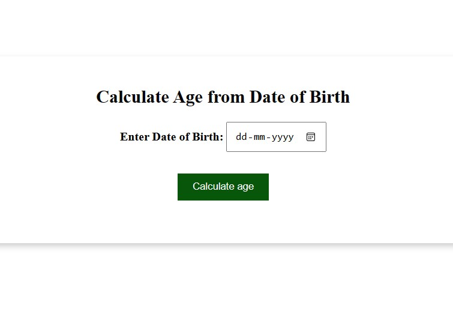
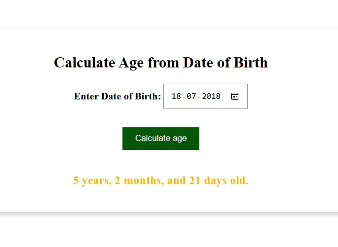

# Age Calculator

## About The Project

A simple web application Calculate Age from Date of Birth

## Tech Stacks Used

## How to use Project

- Download or clone the repository

- Go to the directory
- Run the 76index.html file

## Screenshots

  
After selecting date

